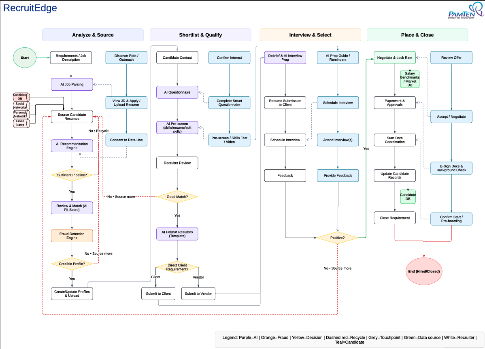

# RecruitEdge – AI Staffing Portal

## Overview
RecruitEdge is an AI-enabled recruitment platform that streamlines resume intelligence, fraud detection, and candidate–job matching. The goal is to reduce manual screening effort, improve detection accuracy, and provide transparent analytics for recruiters and leadership.

## Business Problem
Manual screening and fragmented workflows slow down hiring, create blind spots for fraud/quality issues, and limit decision visibility.

## Responsibilities
- Authored BRDs, FRDs, RTMs, and user stories for core modules (User Management, ATS, Analytics, Resume Intelligence, Fraud Detection).
- Facilitated requirement workshops (JAD), sprint planning, backlog grooming, and UAT coordination.
- Designed process flows in Lucidchart/Visio to eliminate manual dependencies and standardize recruiter workflows.
- Collaborated with engineering on API/interface requirements (Spring Boot services, Google Cloud Storage, Gmail SMTP).
- Built Power BI dashboards for pipeline visibility, recruiter productivity, and risk/fraud metrics.

## Results & Impact
- Reduced manual screening effort through automation.
- Improved fraud detection accuracy with AI-driven checks.
- Increased decision-making visibility using standardized KPIs and executive dashboards.
- Accelerated delivery via clearer scope, prioritization, and governance.

## Architecture & Data
- Source systems: ATS, resume store, fraud/risk signals, audit logs.
- Processing: Spring Boot microservices; orchestration in Azure DevOps.
- Storage: SQL Server; artifacts in Google Cloud Storage.
- Analytics: Power BI dashboards for pipeline, productivity, and quality/risk.

## Tech Stack
Power BI, SQL Server, Spring Boot, Azure DevOps, Google Cloud Storage, Microsoft 365, Lucidchart, MS Visio, Jira

## Screenshots
RecruitEdge Process Flow  

